# Dagoy - Content Sharing Platform (API)

Dagoy is a content platform for users to share their content. The concept is that you cannot follow any users, to keep content democracy on a high level and nobody gets to ride on the "high follower number bluff = quality".. What you can do on Dagoy is bookmark posts, filter them by category and also like posts if you appreciate a users content. 

Each user has access to their own profile once they are signed in where they can create posts, see all their bookmarks, edit their profile image and password.

If anyone needs to get in touch with the admin, they can fill out the contact form and the Admin will haveget in touch as soon as possible.

* Deployed FrontEnd - [Dagoy](https://dagoy-pp5.herokuapp.com/)

* Deployed BackEnd API - [Dagoy DRF API](https://pp5-api-bo.herokuapp.com/)

* BackEnd Repo - [LINK](https://github.com/Bo-Lennart/DRF-PP5-API)

* FrontEnd Repo - [LINK](https://github.com/Bo-Lennart/pp5-content-platform)

## Table of Contents

- [User Stories](#user-stories)
- [Database Schema](#database-schema)
- [Testing](#Testing)
    - [Validators](#validators)
    - [Manual Testing](#manual-testing)
- [Technologies used](#technologies-used)
    - [Languages](#languages)
    - [Libraries, Frameworks & Programs](#libraries-frameworks-&-programs)
- [Deployment](#deployment)
- [Credits](#credits)
    - [content](#content)
    - [Media](#media)

# User Stories

All user stories can be accessed via the KanBan alike board from the "projects tab" on github.
* Front-End: [LINK](https://github.com/users/Bo-Lennart/projects/10)

Within the readme documentation of the Front-end you can have an insight of a detailed view of the agile methodology of this project. [LINK](https://github.com/Bo-Lennart/pp5-content-platform)

* Back-End: [LINK](https://github.com/users/Bo-Lennart/projects/8/views/1)

# Database Schema

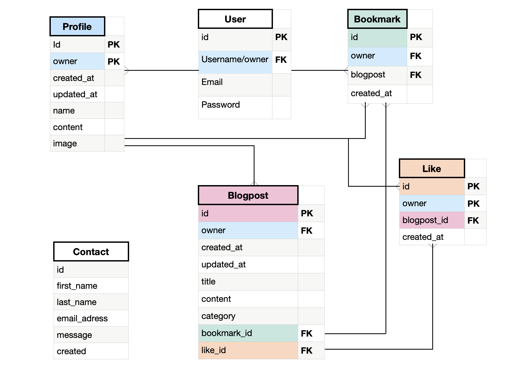

# Testing

## Validators

Running the pep8 validator extension within gitpod showed a number of errors and warnings. Among these where trailing white spaces, missed smicolons and new line after end of code errors. All of these have been resolved and the only warnings left are the ones shown in the settings.py file and .gitpod.yml file.

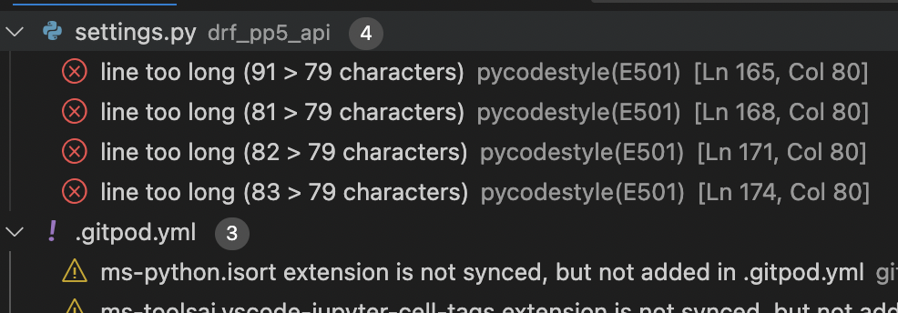

## Manual Testing

* All url paths have been tested manually and verified to work on the deployed page without any errors. They display their intentioned data.

* C.R.U.D functionality has been tested on blogposts, likes, bookmarks and the profile features of adding and removing profile picture as well as changing password.
    * Create new posts, updated and deleted has worked, change category, image, title and content.
    * Create like, check it's info and data as well as removed that like.
    * Create bookmark and remove bookmark with correct data stored.
    * Ensure that bookmarks fetch the correct owner data and post data

# Technologies Used

## Languages
* Python

## Libraries, Frameworks & Programs
* Django
* DRF (Django Rest Framework)
* Django Rest Auth
* PostgreSQL
* Cors Headers
* Cloudinary
* Pillow

# Deployment
1. Create GitHub Repository
2. Create a new app on Heroku
3. Via the resources tab on heroku, add postgres.
4. Start GitPod and install the packages you desire. For me I ran the following via the "pip install" command: 

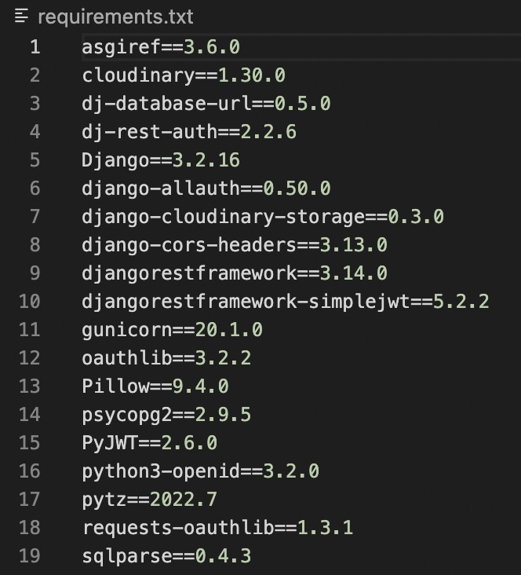

5. Create django project, command:
- 'django-admin startproject project_name .'
6. Go back to Heroku and navigate to the "settings tab" -> Add the following config vars:
    * Key: SECRET_KEY - hidden
    * Key: CLOUDINARY_URL - Value: cloudinary://hidden
    * Key: DISABLE_COLLECTSTATIC - Value: 1
    * ALLOWED_HOST - API-app-name.heroku.com
7. Once you've set up the React app, go ahead and add the following config vars to the API heroku settings tab:
    * Key: CLIENT_ORIGIN - Value: HTTPS adress to your deployed react heroku page.
    * Key: CLIENT_ORIGIN_DEV - Value: The HTTPS adress to your local server when you preview your React app in the dev environment.
8. Create the env.py file and add the following variables to it:

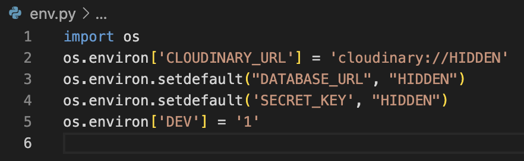

9. Make sure that all you packages are added inside the settinig.py file at the INSTALLED_APPS section. See the screen shot below:

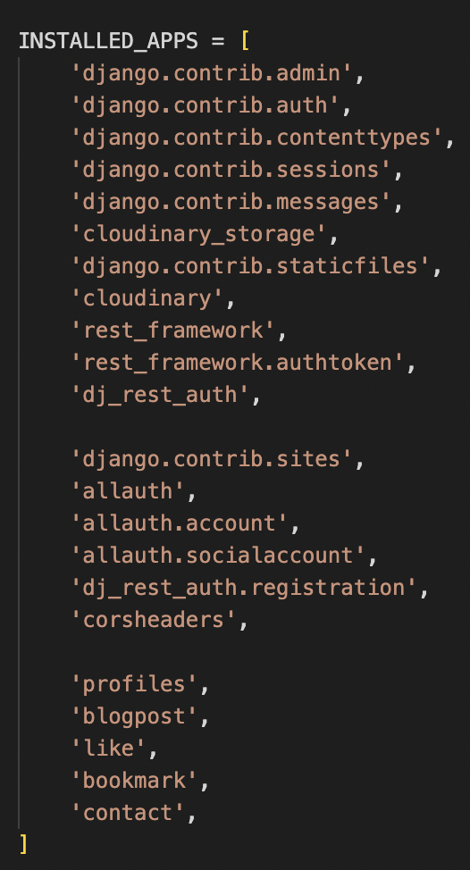

10. Import database to settings.py file and the env.py file when working in DEV environment.

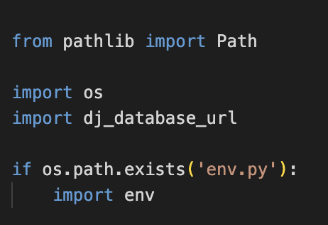

11. Set cloudinary storage and add the following variable into the statement.

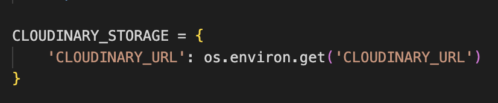

12. Below the INSTALLED_APPS section, set the "site ID": 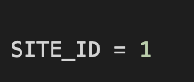

13. Right below BASE_DIR, create the REST_FRAMEWORK and add the page pagination to improve the app loading efficency, pagination count and time/date format.

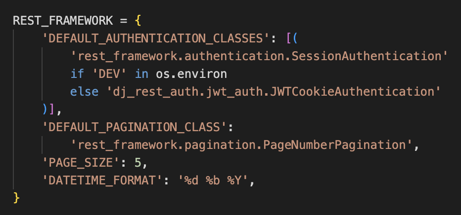

14. Set render default to JSON

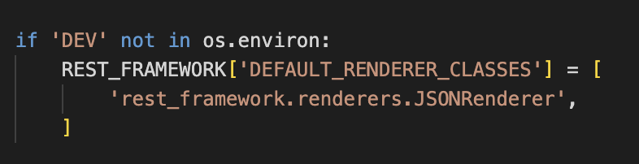

15. Beneath the REST_FRAMEWORK section, add the following code:

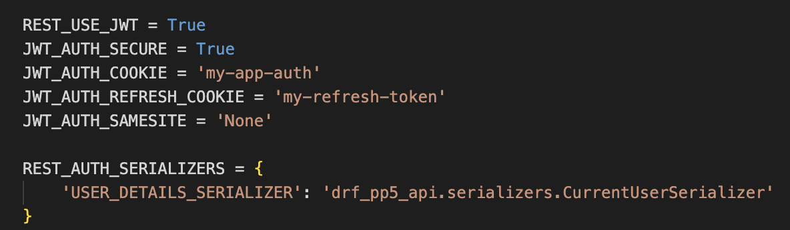

16. Set DEBUG = 'DEV inside the os.environment.
17. Update the database variable to the following: 

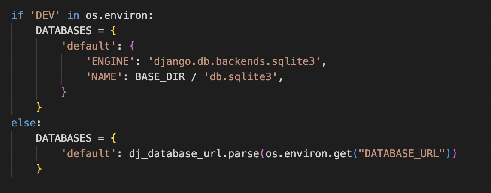

18. Set allowed hosts to your Heroku app and local:

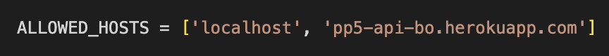

19. Below the ALLOWED_HOST, add the CORS_ALLOWED variable (following the DRF_API Walkthrough by C.I)

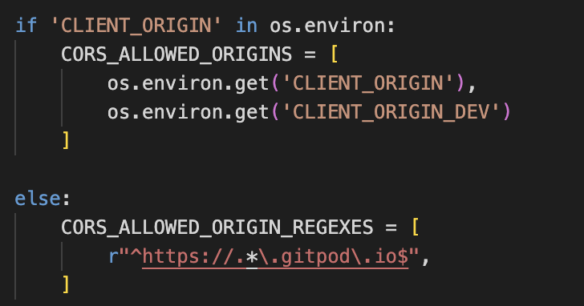

20. At the top of the MIDDLEWARE add:

21. Create the Procfile in order to make Heroka run the following upon deployment release.

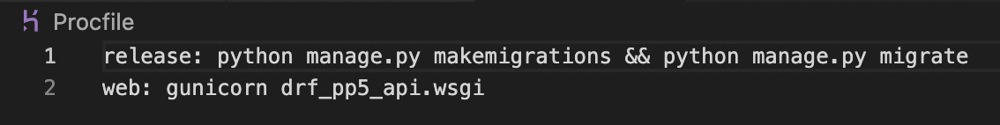

22. pip3 freeze so your 'requirements.txt' file is up to date. 
    * commit and push all changes to your GitHub.
    * Navigate to Heroku, connect your repo to your Heroku app and click Deploy branch.

# Credits

## Content

* This app has been created by following the step by step guide of C.Is DRF-API walkthrough project. 
* Classes and functions are inspired of the project and additionally I have implemented my own two models.
* The Profiles and Posts models have been customized so they matched my project idea. Additionally I've added a bookmark model and contact model with views and serializers too.
* Excellent mentorship by Martina Terlevic in advising me and assisting me with tips on how to get through the project efficiently. Great communication and provided resources.

## Media

* Default profile image and posts image has been taken from the C.I walkthrough project (DRF-API).